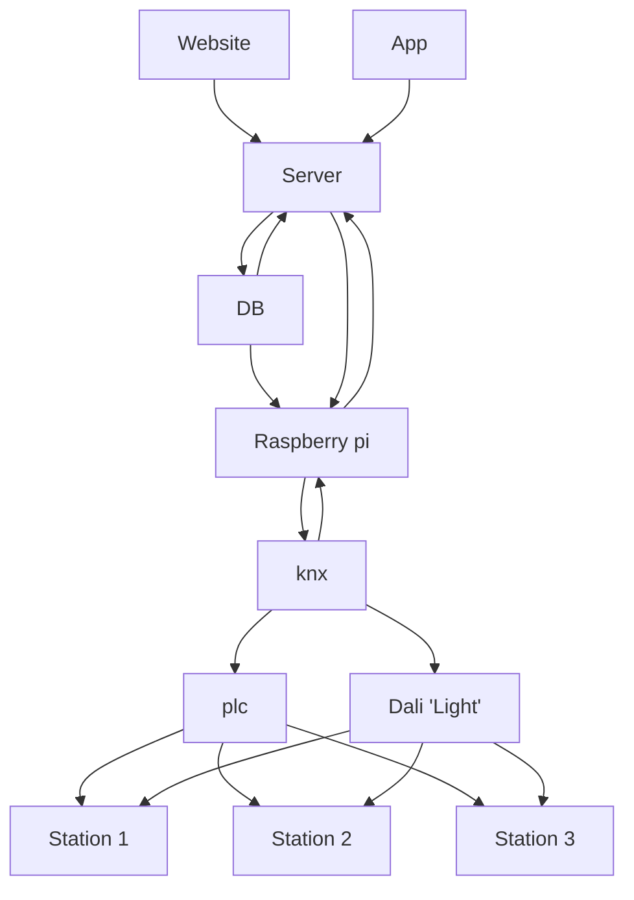

# Project:

A auto repair shop time management system.

This project consists of a backend server + frontend web page, which allows mechanics to easily manage time taking aspects of working on specific cars.

The backend is designed for the idea of having a physical installation at the work location, which can send extra info for the time taking aspect.

# Technical design

# Requirements:

- There should never be more than 1 timer running pr. car

### Possible actions to do in app:

- Start a work timer (This is only when the car is not on a lift)
- pause and resume active timers (applies to both the standard no lift timer, and the list timer)
- stop timer (both types of timers should be able to be manually stopped)
- see all timers for a given car.
- select a car by the car plate.
- register a new car by plate.
